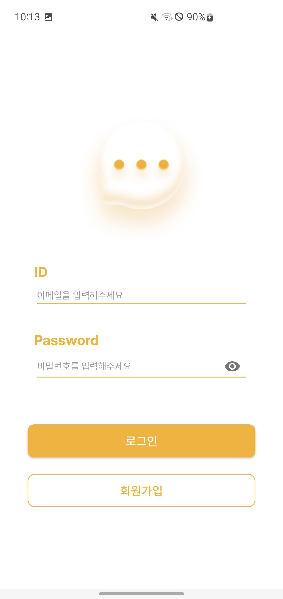
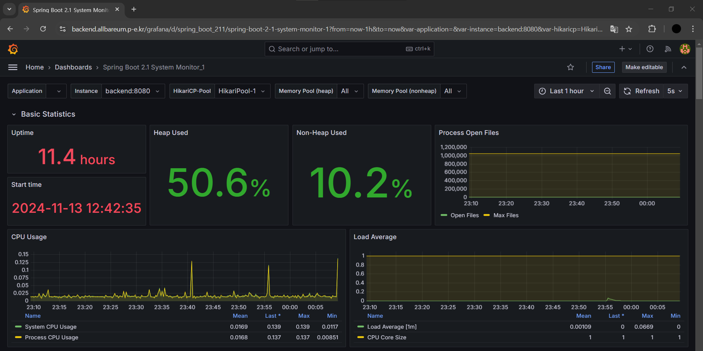

# 올발음 (AllBareum)

### 농·난청인을 위한 발화 교정 애플리케이션

**올발음**은 농·난청인의 발화를 교정하는 데 도움을 주는 애플리케이션입니다. 사용자의 발음을 분석하여 틀린 부분을 알려주고, 정확한 발음과 입 모양에 대한 피드백을 제공합니다.

---
## 🛠 기술 스택

- **백엔드**: Java, Spring Boot, Spring Security, Spring Data JPA
- **데이터베이스**: MySQL (AWS RDS)
- **인프라**: AWS EC2, S3, Docker, GitHub Actions
- **모니터링**: Prometheus, Grafana
- **기타**: TDD (Test-Driven Development), 비동기 처리, 스레드풀

---

## 🚀 주요 기능

### 1. 발음 분석 및 피드백
- 사용자의 발음을 녹음 받아 분석하고, 올바르지 않은 발음에 대해 실시간 피드백 제공

### 2. 인증 및 유저 관리
- **JWT**를 활용한 무상태 토큰 기반 인증 시스템
- 회원가입 및 로그인 기능 (Spring Security)

### 3. API 및 데이터 관리
- 유저 관리, 발음 피드백 기능 등 **RESTful API** 구현
- API 문서화 제공으로 사용성을 높임

### 4. 성능 최적화
- 비동기 및 스레드풀을 적용하여 ML 서버와의 응답 시간을 절반으로 단축 (6초 → 3초)

### 5. CI/CD 파이프라인
- **GitHub Actions**를 이용하여 자동화된 배포 및 테스트 구현
- **Docker**를 사용한 컨테이너화로 일관된 환경에서의 애플리케이션 배포

---

## 📈 모니터링 시스템
- **Prometheus**와 **Grafana**를 이용해 서버 상태를 실시간으로 모니터링 및 관리
- 주요 메트릭을 시각화하여 시스템의 안정성을 높임

---

## 🌐 배포 환경

- **AWS EC2**: 애플리케이션 서버 호스팅
- **AWS RDS**: 분리된 데이터베이스 서버
- **AWS S3**: 정적 파일 관리

---

## 📂 CI/CD 및 컨테이너화

- 모든 기능은 **Docker**로 컨테이너화하여 일관성 있는 환경 제공
- **GitHub Actions**를 사용해 빌드 및 테스트 자동화

---

## 💡 TDD 적용

- **TDD (테스트 주도 개발)** 방식을 통해 코드 안정성과 품질을 높임
- 코드 커버리지: **75%**

---

## 📊 성능 개선 사례

- ML 서버와 프론트엔드 간 응답 시간이 길어지면서, 요청을 비동기 처리 및 스레드풀로 최적화하여 응답 시간을 **6초 → 3초**로 단축하였습니다.

---

## 📸 프로젝트 미리보기

### 로그인 화면


### 발음 교정 화면
 

### 모니터링 시스템


---

## 📦 프로젝트 구조

```plaintext
src/
└── main/
    ├── java/
    │   └── net.allbareum.allbareumbackend/
    │       ├── domain/
    │       │   ├── feedback/
    │       │   │   ├── application/
    │       │   │   ├── domain/
    │       │   │   ├── infrastructure/
    │       │   │   └── presentation/
    │       │   └── user/
    │       │       ├── application/
    │       │       ├── domain/
    │       │       ├── infrastructure/
    │       │       └── presentation/
    │       └── global/
    │           ├── config/
    │           ├── dto.response/
    │           ├── entity/
    │           ├── exception/
    │           ├── security/
    │           ├── service/
    │           └── util/
    └── resources/
        ├── application.yml  # 환경 설정 파일
        └── static/          # 정적 파일
```
